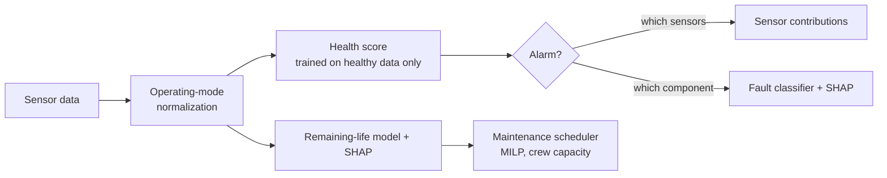

# FaultWatch: early fault detection for marine, power and process equipment

FaultWatch warns you **before** a machine fails. It reads ordinary plant
sensors (temperatures, pressures, speeds, torque, fuel flow) and tells you
four things: that something is drifting, which sensors show it, which
component is likely at fault, and roughly how much life is left. It then
plans when to service each machine.

It is **asset-agnostic**. The same engine runs on a ship's propulsion gas
turbine and on a fleet of gas turbine engines. Adding a new equipment type
means writing a short YAML config, with no code changes.



## Results

Both datasets are public. Every number below is on data the models never saw
during fitting.

### Marine propulsion gas turbine (UCI naval CBM dataset)

A frigate gas turbine simulated at 9 load levels across 1,326 compressor and
turbine decay states. The split is by decay state, so no machine condition
appears in both train and test.

| Alarm method | Faults detected | False alarms on healthy |
|---|---|---|
| Fixed HP-turbine exhaust temperature high alarm | 0% | 0% |
| Same exhaust-temperature alarm, but load-aware | 75% | 0% |
| Multivariate detector, not load-aware | 5% | 1% |
| **FaultWatch (multivariate + load-aware)** | **95%** | 3% |


* **Load awareness is the whole game.** Sensor values move far more with
  ship speed than with wear, so a fixed alarm has to sit above full-load
  readings and never catches degradation.
* **Diagnosis:** the fault classifier (healthy / compressor / turbine /
  combined) reaches 97.8% accuracy (macro-F1 0.94).
* **Severity:** decay is estimated to within 1.1% (compressor) and 1.7%
  (turbine) of the full decay range, with R² ≥ 0.99.

Here is an example alert as an operator would see it (from `metrics.json`):

```text
Load: lever position 3.1         Health score 247  (alarm above 24)
Driven by: comp_out_press +11.1σ (52%), hpt_exit_temp +6.9σ (27%), gt_rpm -7.5σ (10%)
Diagnosis: turbine decay 100%          Truth: turbine decay kMt = 0.983
```

### Gas turbine fleet run to failure (NASA C-MAPSS FD001)

This set has 100 engines recorded from healthy to failure, plus 100 test
engines cut off at an unknown point. Early-warning results come from 5-fold
out-of-fold runs, so each engine is scored by a model that never saw it.

| Alarm method | Warned in time | Median warning | ≥ 20 cycles warning | False early alarms* |
|---|---|---|---|---|
| Fixed exhaust (LPT outlet) temperature alarm | 94% | 11 cycles | 17% | 0% |
| Multivariate, one baseline for the whole fleet | 47% | 27 cycles | 34% | 0% |
| **FaultWatch (each engine vs. its own early life)** | **100%** | **84 cycles** | **100%** | **0%** |

\*An alarm in the first 40% of an engine's life counts as false. All alarms
must persist for 5 cycles.


* **Remaining life** on the 100 test engines: RMSE 12.3 cycles and MAE 9.7,
  against 43.1 for a constant guess. The NASA asymmetric score is 244.
* **Per-machine baselines matter.** Engines differ from each other when new.
  Judging each one against its own first 30 cycles turns a 47% warning rate
  into 100%.

**Maintenance plan.** The 25 test engines that will fail within 30 days are
scheduled with 3 crews per day. Each machine's failure risk comes from its
predicted remaining life ± model error. Costs are assumed: $20k per planned
service, $250k per in-service failure, and $150 per cycle of life thrown away.

| Policy | In-service failures | Cost |
|---|---|---|
| Run to failure | 25 | $6.25M |
| **FaultWatch plan** | **1** | **$0.90M** |
| Perfect foresight (theoretical best) | 0 | $0.51M |

## Quick start

```bash
brew install libomp                      # macOS only: OpenMP runtime for LightGBM
pip install -r requirements.txt
python scripts/download_data.py          # ~15 MB, UCI + NASA
python run.py configs/naval_gas_turbine.yaml configs/turbofan_cmapss.yaml
python -m pytest -q                      # unit tests on synthetic data
```

Outputs (metrics JSON, CSVs and charts) are written to `reports/<asset>/`.
Both runs finish in under a minute on a laptop CPU.

## Adding a new asset (e.g. a ship's diesel generator, a boiler feed pump)

1. Write a loader in `faultwatch/data.py` that returns a DataFrame.
2. Copy a config and list:
   * `sensors`: the measurements to watch;
   * `regime_features`: what sets the operating point (load, speed,
     ambient temperature);
   * `asset_id` / `time` for run-to-failure fleets;
   * the healthy window, alarm persistence, and maintenance costs.
3. Run `python run.py configs/your_asset.yaml`.

Two experiment types cover most real data:

* `steady_state`: labeled degradation states observed across operating points,
  such as test-bed or simulator data.
* `run_to_failure`: time series per machine ending in failure or overhaul,
  such as a historian export plus the CMMS work-order history.

## Project layout

```
faultwatch/
  regime.py      operating-mode normalization, per-asset baselines, smoothing
  anomaly.py     health detector (Mahalanobis / Isolation Forest), alarm persistence, sensor contributions
  models.py      LightGBM classifier/regressors, trend features, NASA score
  explain.py     SHAP importances
  schedule.py    risk-based maintenance MILP (PuLP/CBC)
  experiments/   steady_state.py, run_to_failure.py
configs/         one YAML per asset type
reports/         generated metrics and charts
tests/           fast synthetic tests
```

## Honest limits

* **Both datasets are simulated.** Real plant data adds sensor dropouts,
  recalibrations, operator actions and far fewer failure examples. The
  detector trains on healthy data only for exactly that reason.
* **The method transfers, the trained model does not.** Each new machine
  needs its own healthy baseline, typically a few weeks of normal operation.
* **The naval false-alarm rate is based on a small sample.** It is 3% on
  99 healthy test points, against a 1% target. More healthy data would
  calibrate it tighter.
* **The maintenance costs are illustrative.** Replace them with your own.

## Roadmap

- [ ] Wind turbine SCADA and bearing-vibration (CWRU) configs
- [ ] Tennessee Eastman process-plant config
- [ ] MLflow tracking and a model registry
- [ ] FastAPI scoring endpoint and a drift monitor with retraining trigger
- [ ] Streamlit dashboard for operators
- [ ] RAG assistant: alarm + equipment manuals → likely causes and checks

## Data credits

* Coraddu, A., Oneto, L., Ghio, A., Savio, S., Anguita, D., Figari, M. (2014).
  *Condition Based Maintenance of Naval Propulsion Plants.* UCI Machine Learning Repository.
* Saxena, A., Goebel, K. (2008). *Turbofan Engine Degradation Simulation Data Set.*
  NASA Prognostics Data Repository.
