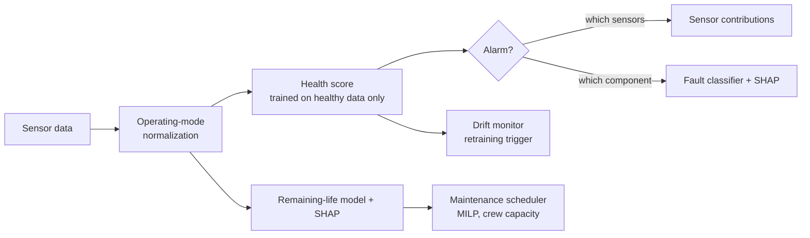

# FaultWatch: early fault detection for marine, power and process equipment

FaultWatch warns you **before** a machine fails. It reads ordinary plant
sensors (temperatures, pressures, speeds, vibration, flows) and tells you
that something is drifting, which sensors show it, which component is likely
at fault, and roughly how much life is left. It then plans when to service
each machine.

It is **asset-agnostic**. One engine runs on a ship's propulsion gas turbine,
a gas turbine fleet, onshore wind turbines, motor bearings and a chemical
plant. Adding a new equipment type means writing a short YAML config, with no
code changes. It ships with an API, an operator dashboard, MLflow tracking and
a drift monitor that says when a baseline needs retraining.



## Results at a glance

Five public datasets across four domains. Every number is on data the models
never saw during fitting, compared with the alarm a plant typically has today.

| Domain | Asset (data) | Tested on | Conventional alarm | **FaultWatch** |
|---|---|---|---|---|
| Marine | Frigate propulsion gas turbine (UCI, simulated) | Unseen decay states | Exhaust-temp alarm: 0% of faults | **95% of faults**, 3% false alarms |
| Power | Gas turbine fleet (NASA C-MAPSS, simulated) | 100 unseen engines | Exhaust-temp alarm: 11 cycles' warning | **84 cycles' warning**, all 100 engines, no false alarms |
| Power | Onshore wind turbines (CARE / EDP, **real SCADA**) | 12 logged failures, 10 normal periods | Temperature limits: 3 caught, 2 false | **5 caught** a median 5.5 days ahead, **0 false** |
| Rotating | Motor bearings (CWRU vibration, test rig) | Bearings never seen in training | RMS alarm: 100% detected | 100% detected; names inner-race faults 88% right |
| Process | Tennessee Eastman plant (simulated) | 21 process faults | Tag limits: 87% detected at **40%** false alarms | 74% detected at **2%** false alarms |

Not every row is a win. Bearings of this size are easy to detect even with an
RMS alarm, and on the process plant, limits tuned in hindsight come within a
few points of FaultWatch. The details, the misses and why they happen are
below.

## Results by asset

### Marine propulsion gas turbine (UCI naval CBM dataset)

A frigate gas turbine simulated at 9 load levels across 1,326 compressor and
turbine decay states. The split is by decay state, so no machine condition
appears in both train and test.

| Alarm method | Faults detected | False alarms on healthy |
|---|---|---|
| Fixed HP-turbine exhaust temperature high alarm | 0% | 0% |
| Same exhaust-temperature alarm, but load-aware | 75% | 0% |
| Multivariate detector, not load-aware | 5% | 1% |
| **FaultWatch (multivariate + load-aware)** | **95%** | 3% |


* **Load awareness is the whole game.** Sensor values move far more with
  ship speed than with wear, so a fixed alarm has to sit above full-load
  readings and never catches degradation.
* **Diagnosis:** the fault classifier (healthy / compressor / turbine /
  combined) reaches 97.8% accuracy (macro-F1 0.94).
* **Severity:** decay is estimated to within 1.1% (compressor) and 1.7%
  (turbine) of the full decay range, with R² ≥ 0.99.

Here is an example alert as an operator would see it (from `metrics.json`):

```text
Load: lever position 3.1         Health score 247  (alarm above 24)
Driven by: comp_out_press +11.1σ (52%), hpt_exit_temp +6.9σ (27%), gt_rpm -7.5σ (10%)
Diagnosis: turbine decay 100%          Truth: turbine decay kMt = 0.983
```

### Gas turbine fleet run to failure (NASA C-MAPSS FD001)

This set has 100 engines recorded from healthy to failure, plus 100 test
engines cut off at an unknown point. Early-warning results come from 5-fold
out-of-fold runs, so each engine is scored by a model that never saw it.

| Alarm method | Warned in time | Median warning | ≥ 20 cycles warning | False early alarms* |
|---|---|---|---|---|
| Fixed exhaust (LPT outlet) temperature alarm | 94% | 11 cycles | 17% | 0% |
| Multivariate, one baseline for the whole fleet | 47% | 27 cycles | 34% | 0% |
| **FaultWatch (each engine vs. its own early life)** | **100%** | **84 cycles** | **100%** | **0%** |

\*An alarm in the first 40% of an engine's life counts as false. All alarms
must persist for 5 cycles.


* **Remaining life** on the 100 test engines: RMSE 12.3 cycles and MAE 9.7,
  against 43.1 for a constant guess. The NASA asymmetric score is 244.
* **Per-machine baselines matter.** Engines differ from each other when new.
  Judging each one against its own first 30 cycles turns a 47% warning rate
  into 100%.

**Maintenance plan.** The 25 test engines that will fail within 30 days are
scheduled with 3 crews per day. Each machine's failure risk comes from its
predicted remaining life ± model error. Costs are assumed: $20k per planned
service, $250k per in-service failure, and $150 per cycle of life thrown away.

| Policy | In-service failures | Cost |
|---|---|---|
| Run to failure | 25 | $6.25M |
| **FaultWatch plan** | **1** | **$0.90M** |
| Perfect foresight (theoretical best) | 0 | $0.51M |

### Onshore wind turbines (CARE to Compare, Wind Farm A: real SCADA)

Five turbines of an EDP wind farm in Portugal, 10-minute SCADA data and a fault
logbook. There are 22 datasets. Each has a normal-operation training period
followed by a prediction period that holds either a logged failure (with a
labelled pre-failure window) or normal operation. Each turbine gets its own
normal-behaviour model: every component temperature is predicted from power,
the last hour of power, wind speed, rotor speed and ambient temperature.
The alarm settings (0.1% per-sample rate, 3 h smoothing, 1 h persistence) were
fixed in the config before scoring any event.

| Alarm method | Failures caught in the window | Median warning | Alarms before the window | Normal periods with a false alarm |
|---|---|---|---|---|
| High-temperature limits (training max per sensor) | 3 / 12 | 8.6 days | 2 | 2 / 10 |
| Multivariate, not power-aware | 3 / 12 | 8.9 days | 0 | 0 / 10 |
| **FaultWatch** | **5 / 12** | **5.5 days** | **0** | **0 / 10** |


* **Root cause.** For the generator bearing failure on turbine 10, 67% of the
  first alarm comes from the generator non-drive-end bearing temperature.
  For the hydraulic-group events, the alarm points at converter and stator
  temperatures rather than hydraulic oil, so the alarm is real but the
  sensor attribution would not have named the component.
* **Misses (7 of 12)** include both gearbox failures and the turbine-0 generator
  bearing. In that case one bearing temperature drifts up 1-3σ, but in a
  24-sensor score that single-sensor drift stays under the threshold. See
  the roadmap.

### Motor bearings (CWRU bearing vibration)

A 12 kHz drive-end accelerometer on a 2 HP motor with seeded inner-race,
outer-race and ball defects at 0-3 HP load. Each 0.34 s window becomes the
features a vibration analyst reads: RMS, crest factor, kurtosis, band
energies, and envelope-spectrum peaks at the bearing defect frequencies
(BPFI, BPFO, BSF).

**The test uses bearings never seen in training.** All 0.007" and 0.021"
defects train the models; every 0.014" recording (physically different
bearings) is held out. See "Data pitfalls" for why this matters.

| Alarm method | Faults detected | False alarms on healthy |
|---|---|---|
| Overall vibration (RMS) alarm | 100% | 0% |
| **FaultWatch** | **100%** | 10% (3 of 31 windows) |


* **Detection is easy on this rig**, and a plain RMS alarm does it too.
* **Diagnosis** reads which defect frequency dominates the envelope spectrum.
  A logistic model on those three features was picked by leave-one-defect-size-out
  validation on the *training* bearings (78% there vs 51% for a tree model on
  all features). On the unseen bearings it names inner-race faults correctly
  88% of the time and ball faults 48% of the time. It gets outer-race faults
  0% right: the 0.014" outer-race recordings show no outer-race signature
  at all (their envelope peaks and RMS sit at healthy levels), a known quirk
  of this dataset.

### Chemical process plant (Tennessee Eastman)

The standard process-monitoring benchmark: reactor, condenser, separator,
stripper and compressor, 41 measurements and 11 valve positions, 21 scripted
faults introduced after 8 hours.

| Alarm method | Fault samples detected | False alarms | Median detection delay |
|---|---|---|---|
| High/low limits on every tag (set to a 1% budget on training data) | 87% | 40% | 6 min |
| Same limits, re-tuned **on the test data** to FaultWatch's false-alarm rate | 70% | 1.3% | n/a |
| **FaultWatch** | **74%** | **2.1%** | 36 min |


* With 52 tags, per-tag limits set on 25 hours of normal data chatter
  constantly in service (40% of normal samples alarm). The multivariate score
  holds its false-alarm budget without being tuned on in-service data.
* Faults 3, 9 and 15 are known to be almost invisible in this data set. They
  stay near the false-alarm rate here too.
* Diagnosis across 21 faults + normal: 62.5% accuracy (macro-F1 0.68). Most
  errors are between those three invisible faults and normal operation.

## Running it

### Quick start

```bash
brew install libomp                      # macOS only: OpenMP runtime for LightGBM
pip install -r requirements.txt
python scripts/download_data.py          # ~330 MB; or name some: naval cmapss cwru tep wind
python run.py configs/*.yaml             # trains every asset, writes reports/ and models/
python -m pytest -q                      # unit tests on synthetic data, no downloads needed
```

The wind download reads only Wind Farm A (~160 MB) out of the 5.5 GB CARE
archive with HTTP range requests.

### Operator dashboard

```bash
streamlit run dashboard.py               # http://localhost:8501/?asset=wind_turbine_care
```

For each asset type it shows the live condition (fleet table with health,
remaining life and the planned service day, or a machine's health timeline),
what is driving the health score, a drift check with a simulated sensor
recalibration, and the validation results.

### Scoring API

```bash
uvicorn api:app                          # docs at http://127.0.0.1:8000/docs
```

| Endpoint | Returns |
|---|---|
| `GET /assets` | Trained asset types and the columns each needs |
| `POST /assets/{name}/score` | Per sample: health score, alarm, driving sensors, diagnosis, severity or remaining life |
| `POST /assets/{name}/drift` | Whether the healthy baseline is still valid (the retraining trigger) |
| `POST /assets/{name}/plan` | Service day per machine from the latest remaining-life estimates |

The API, the dashboard and the MLflow model all score through the same
`Scorer` class. Its remaining-life predictions on the C-MAPSS test fleet match
the offline report exactly.

### MLflow tracking and model registry

```bash
python run.py configs/*.yaml --mlflow
mlflow ui --backend-store-uri sqlite:///mlflow.db
```

Each run logs its config, every metric and the report charts, and registers a
new version of `faultwatch-<asset>` as a pyfunc model, which
`mlflow models serve` can serve.

### Drift monitor

The detector alarms on faults; the drift monitor asks a different question:
*is "normal" still what we trained on?* It looks only at samples the detector
calls normal, so a developing fault is not mistaken for drift. It recommends
retraining when:

* a sensor's residual distribution on normal data shifts (PSI > 0.25), which is
  typical after a sensor recalibration or a component swap; or
* more than 5% of samples fall outside the operating envelope seen in training.

A 2σ step in one sensor midway through the turbine fleet's history triggers it.
A 3σ step does not, because those samples already raise a fault alarm.

## Data pitfalls found along the way

Each of these produces results that look far better than they are:

1. **CWRU sampling rates.** The normal-baseline recordings are sampled at
   48 kHz, the fault recordings at 12 kHz. Mixed unconverted, "normal" is
   separable by sampling rate alone (spectral correlation with the fault
   recordings rises from 0.00 to 0.50 once resampled). FaultWatch resamples
   them to 12 kHz.
2. **CWRU window leakage.** Splitting windows of one recording between train
   and test lets a model recognise the individual bearing. With that split,
   every method here scores 100%. Holding out whole defect sizes drops
   diagnosis to the numbers above.
3. **Calibrating alarms on autocorrelated data.** A random calibration slice of
   a slow process is nearly a copy of the fitting data, so the threshold is too
   low. On Tennessee Eastman that meant 8.3% false alarms instead of 2.1%.
   `calibration: blocked` cross-fits on contiguous time blocks.
4. **Status codes that leak the label.** In CARE Wind Farm A, the labelled
   pre-failure windows are coded "downtime" while the turbines are producing
   up to full power. Filtering on status removes every failure from the
   test. FaultWatch uses status codes only to clean the training history.

## Adding a new asset (e.g. a ship's diesel generator, a boiler feed pump)

1. Write a loader in `faultwatch/data.py` that returns a DataFrame.
2. Copy the closest config and list:
   * `sensors`: the measurements to watch;
   * `regime_features`: what sets the operating point (load, speed,
     ambient temperature);
   * `asset_id` / `time` for fleets and time series;
   * the healthy window, alarm settings, and maintenance costs.
3. Run `python run.py configs/your_asset.yaml`.

Four experiment types cover most real data:

| Type | Data it fits | Example here |
|---|---|---|
| `steady_state` | Labeled degradation states across operating points (test bed, simulator) | Naval gas turbine |
| `run_to_failure` | Time series per machine ending in failure or overhaul (historian + CMMS) | C-MAPSS fleet |
| `event_detection` | Per-machine SCADA history plus a fault logbook | Wind turbines |
| `labeled_faults` | A library of recorded faults with known labels (rig, simulator) | Bearings, Tennessee Eastman |

## Project layout

```
faultwatch/
  regime.py        operating-mode normalization, per-asset baselines, smoothing
  anomaly.py       health detector (Mahalanobis / Isolation Forest), blocked calibration, persistence, contributions
  models.py        LightGBM / logistic classifiers, regressors, trend features, NASA score
  explain.py       SHAP importances
  schedule.py      risk-based maintenance MILP (PuLP/CBC)
  serve.py         model bundles, Scorer, drift monitor
  tracking.py      MLflow logging and model registry
  data.py          loaders: naval, C-MAPSS, CWRU (vibration features), Tennessee Eastman, CARE
  experiments/     steady_state, run_to_failure, event_detection, labeled_faults
api.py             FastAPI scoring service
dashboard.py       Streamlit operator dashboard
configs/           one YAML per asset type
reports/           generated metrics and charts
tests/             fast synthetic tests (detector, scheduler, scorer, drift, API)
```

## Honest limits

* **Four of the five datasets are simulated or from a test rig.** Only the wind
  data is real operation, and there FaultWatch catches 5 of 12 failures. Real
  plant data adds sensor dropouts, recalibrations, operator actions and far
  fewer failure examples. The detector trains on healthy data only for that
  reason.
* **The method transfers, the trained model does not.** Each new machine
  needs its own healthy baseline, typically a few weeks of normal operation.
* **Single-sensor drift gets diluted.** One bearing temperature creeping up
  1-3σ among 24 sensors can stay under a multivariate threshold (the missed
  turbine-0 generator bearing).
* **Small healthy test sets.** Naval (99 samples) and bearing (31 windows)
  false-alarm rates are rough.
* **The maintenance costs are illustrative.** Replace them with your own.

## Roadmap

- [x] Wind turbine SCADA and bearing-vibration (CWRU) configs
- [x] Tennessee Eastman process-plant config
- [x] MLflow tracking and a model registry
- [x] FastAPI scoring endpoint and a drift monitor with retraining trigger
- [x] Streamlit dashboard for operators
- [ ] Per-component health scores next to the overall score, to catch single-sensor drift
- [ ] Wind farms B and C (offshore, 257 and 957 signals) to test at scale
- [ ] RAG assistant: alarm + equipment manuals → likely causes and checks

## Data credits

* Coraddu, A., Oneto, L., Ghio, A., Savio, S., Anguita, D., Figari, M. (2014).
  *Condition Based Maintenance of Naval Propulsion Plants.* UCI Machine Learning Repository.
* Saxena, A., Goebel, K. (2008). *Turbofan Engine Degradation Simulation Data Set.*
  NASA Prognostics Data Repository.
* Gück, C., Roelofs, C., Faulstich, S. (2024). *CARE to Compare: A real-world
  dataset for anomaly detection in wind turbine data.* Zenodo. Wind Farm A is
  based on the EDP open data platform.
* Case Western Reserve University Bearing Data Center, *Seeded fault test data.*
* Downs, J. J., Vogel, E. F. (1993). *A plant-wide industrial process control
  problem.* Data: Braatz group Tennessee Eastman set (Chiang, Russell, Braatz, 2001).
