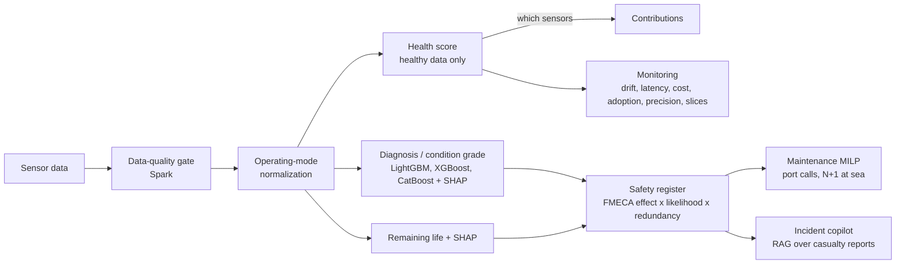
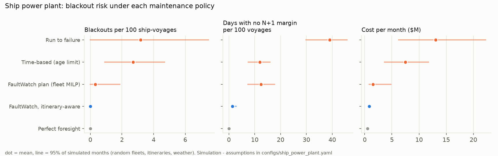
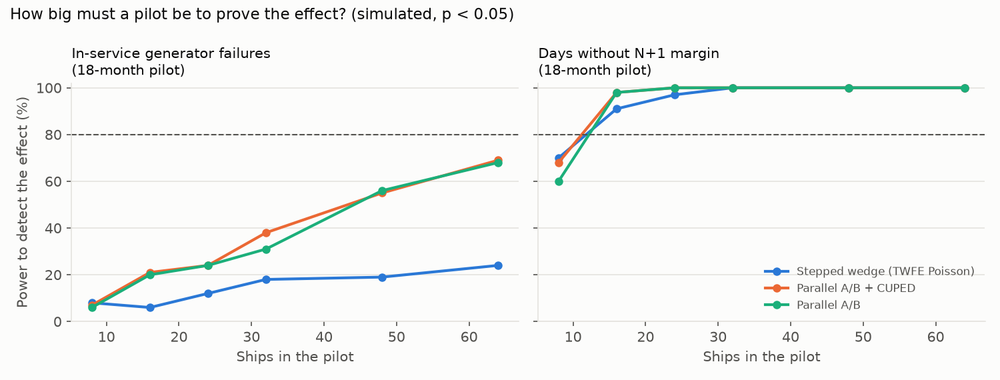
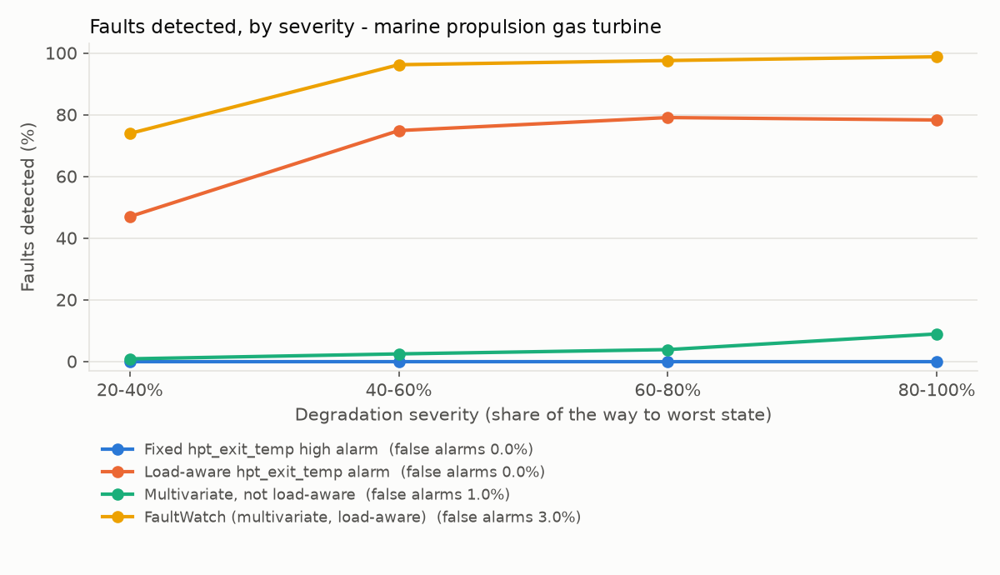
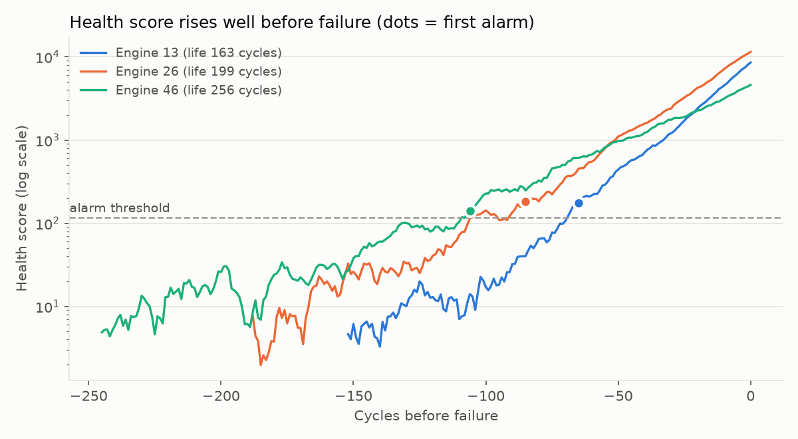
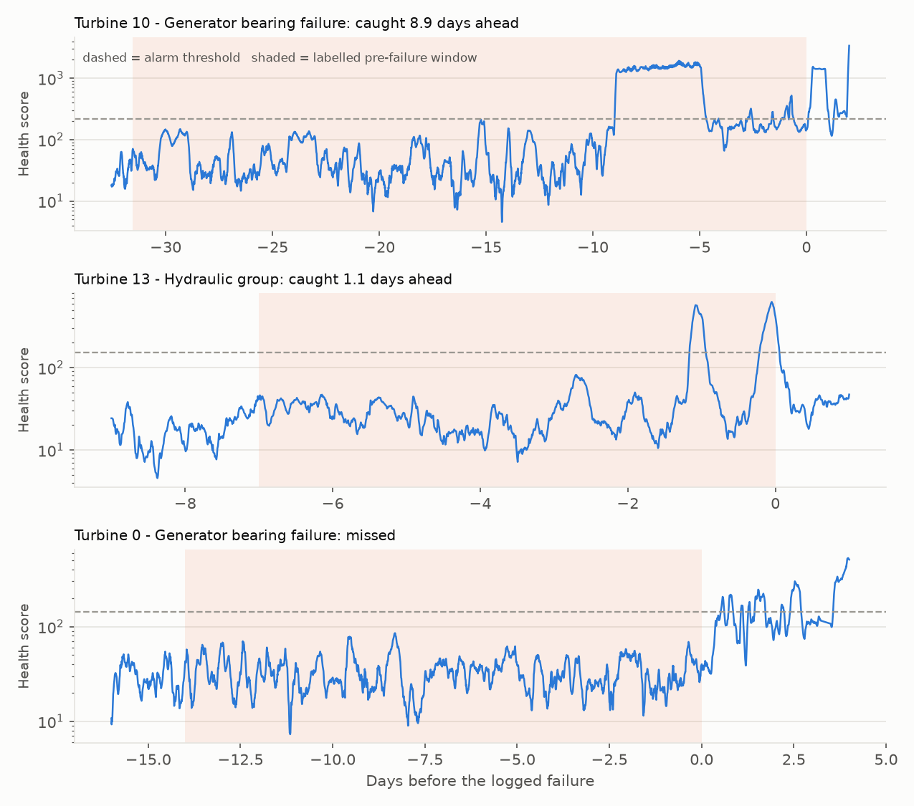
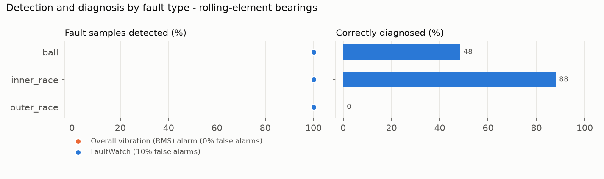
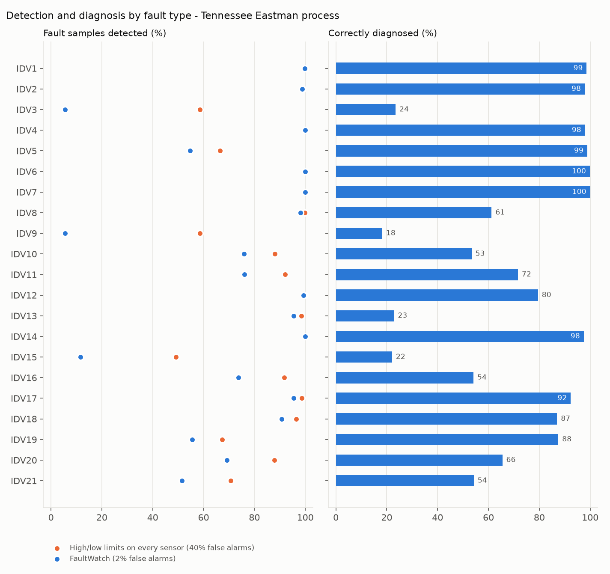
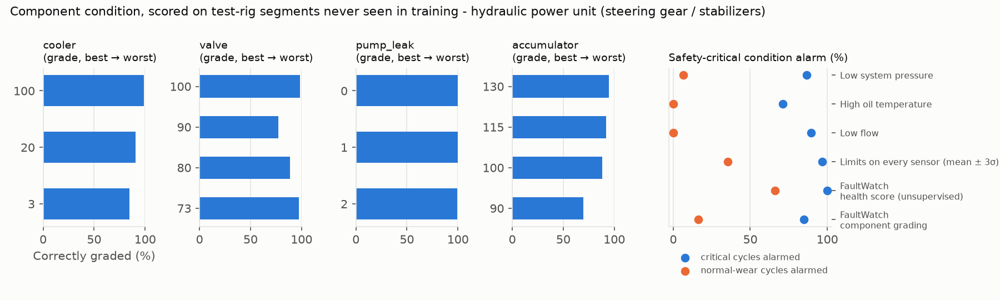

# FaultWatch: shipboard machinery safety analytics

FaultWatch warns **before** a machine fails, and says what that failure would
mean for the ship. It reads ordinary machinery sensors (temperatures,
pressures, speeds, vibration, flows) and answers the questions a fleet
technical and safety team asks every day:

1. **Is anything degrading, and which component?** Health score trained on
   healthy data only, sensor contributions, fault diagnosis, condition grade,
   remaining life (SHAP for every model).
2. **What would the failure do to the ship, and how likely is it this
   voyage?** An FMECA-style register maps each failure mode to its ship-level
   effect (loss of propulsion, blackout, loss of steering, fire risk), with
   redundancy, likelihood within the horizon and a recommended action.
3. **When should we service it?** A maintenance MILP that respects port calls,
   crew capacity and the N+1 rule at sea.
4. **What happened on other ships when this failed?** A retrieval-augmented
   copilot over 146 machinery-casualty investigation reports, every sentence
   cited.
5. **Did the program actually reduce failures?** Confidence intervals and
   paired tests on every result, a fleet blackout simulation, and a pilot
   design with power analysis.

Safety is treated as the *consequence* of equipment failure. The engine is
asset-agnostic: a new equipment type is a YAML config, not new code.



## What it shows on cruise-ship machinery

The datasets are public. Each one stands in for a shipboard system:

| Shipboard system | Data used here | Ship-level effect of failure |
|---|---|---|
| Gas-turbine propulsion (LM2500 class, as in Radiance- and Millennium-class COGES plants) | UCI naval propulsion plant (simulated) | Loss of propulsion |
| Gas-turbine / diesel generator sets | NASA C-MAPSS fleet (simulated, run to failure) | Blackout when two sets are down |
| Steering gear and fin stabilizer hydraulic power units | UCI hydraulic test rig (real rig) | Loss of steering; hot-oil fire risk |
| Propulsion motor / pod bearings | CWRU bearing vibration (test rig) | Loss of propulsion |
| Rotating plant under varying load | CARE wind-farm SCADA (**real operation**) | Generating unit out of service |
| Fuel treatment and process systems | Tennessee Eastman (simulated) | Process upset |

## Results at a glance

Every number is on data the models never saw during fitting, compared with
the alarm a plant typically has today. 95% confidence intervals resample the
independent unit (machine, recording, event), not individual samples.

| System (data) | Conventional alarm | **FaultWatch** |
|---|---|---|
| Gas-turbine propulsion (UCI, simulated) | Exhaust-temp alarm: 0% of faults | **95% of faults** (CI 94-97), 3% false alarms |
| Generator-set fleet (C-MAPSS, simulated) | Exhaust-temp alarm: 11 cycles' warning | **84 cycles' warning** (CI 76-90), all 100 engines, no false alarms |
| Rotating plant (CARE, **real SCADA**) | Temperature limits: 3 of 12 caught, 2 false | **5 of 12 caught**, 0 false - not yet statistically significant |
| Steering hydraulics (UCI rig) | Low-flow alarm: 90% of critical states, can't say which part | Names the failing component: pump leakage 99.8%, valve 93%, cooler 92%, accumulator 84% |
| Motor bearings (CWRU rig) | RMS alarm: 100% detected | 100% detected; names inner-race faults 88% right |
| Process plant (Tennessee Eastman) | Tag limits: 87% detected at **40%** false alarms | 74% detected at **2%** false alarms |

**Fleet scenarios** (simulation; assumptions in the configs):

| Question | Answer |
|---|---|
| Blackouts per 100 ship-voyages, next 30 days | run-to-failure 3.2 · time-based 2.7 · FaultWatch plan 0.3 · **FaultWatch itinerary-aware 0** (in all 200 simulated months) |
| Days a ship sails without an N+1 power margin, per 100 voyages | time-based 12 · FaultWatch plan 12 · **itinerary-aware 1.4** |
| Smallest pilot that can prove it (80% power) | **16-24 ships for 6 months**, measured on N+1-margin days; in-service failures are too rare to be the primary metric |

**Incident copilot** (146 reports, 57 gold questions, 6 off-topic): hybrid
retrieval finds the right report in the top 3 for 96% of technical questions
and 83% of colloquial ones; 100% of citations point at retrieved passages;
6/6 off-topic questions refused, 0 answerable ones refused.

Not every row is a win. Bearings this size are easy for an RMS alarm too; on
the process plant, limits tuned in hindsight come close; the hydraulic rig's
simple low-flow alarm already catches most critical states (FaultWatch's value
there is *which* component, which decides the repair and the safety effect);
and 12 wind-turbine failures are too few to prove a difference.

## The safety layer

`faultwatch/safety.py` turns model outputs into a ranked **safety-risk
register**. Each asset config carries an FMECA block, e.g. for the steering
gear power unit:

```yaml
safety:
  system: steering_gear
  redundancy: 2           # SOLAS: two independent power units
  failure_modes:
    pump_leak:   {effect: loss_of_steering, severity: 4}
    valve:       {effect: loss_of_steering, severity: 4}
    accumulator: {effect: loss_of_steering, severity: 3}
    cooler:      {effect: fire_risk,        severity: 3}
```

* **Likelihood** within the horizon comes from whatever the model provides:
  remaining life +/- its cross-validated error, the probability that a
  component is at a critical grade, or a confirmed alarm with its diagnosis.
* **Redundancy:** a k-out-of-n calculation gives P(the ship loses the
  function). With four generator sets and two needed, a 50% chance per set is
  only a 31% chance of blackout; three sets at 99% is near-certain.
* **Risk class:** likelihood band x severity, with an action per class:
  *act before the next sea passage*, *plan at the next port call*, *monitor*.
* The FMECA is read from the current configs at load time, so a safety
  engineer can change a severity or a redundancy without retraining.

The API serves it at `POST /assets/{name}/risk`; the dashboard shows it per
asset and can hand the top item to the copilot.

### Power plant blackout simulation (`configs/ship_power_plant.yaml`)

25 ships x 4 generator sets. Each set is a real C-MAPSS test engine with its
true remaining life and the life FaultWatch predicted for it. A 7-night
itinerary sets the load each day (port: 1 set, sea: 2, manoeuvring or heavy
weather: 3). A day is a **blackout** when fewer sets are available than the
load needs, and a **no-margin day** when exactly enough are. 200 simulated
months randomize which engines sit on which ship, the itinerary phase and the
weather.

| Policy | Blackouts / 100 voyages | No-margin days / 100 voyages | In-service failures | Planned services | Cost / month |
|---|---|---|---|---|---|
| Run to failure | 3.2 | 39 | 25 | 0 | $13.1M |
| Time-based (age limit) | 2.7 | 12 | 2 | 59 | $7.5M |
| FaultWatch plan (fleet MILP) | 0.3 | 12 | 1 | 29 | $1.5M |
| **FaultWatch, itinerary-aware** | **0** | **1.4** | 1 | 29 | **$0.84M** |
| Perfect foresight | 0 | 0 | 0 | 25 | $0.50M |



The itinerary-aware plan services sets alongside or keeps an N+1 margin at
sea; the plain fleet plan services at sea whenever crews are free, which
removes the margin exactly when a second trip would cause a blackout. The
itinerary, loads, durations and costs are assumptions in the config; replace
them with a real fleet's.

### How to prove it on real ships (`configs/fleet_rollout.yaml`, `docs/pilot_design.md`)

The effect sizes from the simulation feed a pilot-design study: simulated
ship-month outcomes (with ship-to-ship variation and a seasonal swing a naive
before/after comparison would mistake for an effect) are analysed exactly as
a real pilot would be.

* **In-service failures are too rare to be the primary metric.** No design
  reaches 80% power, even with 64 ships for 18 months.
* **Days without an N+1 margin are the leading indicator to use.** A parallel
  A/B on 16 ships for 6 months, or a stepped-wedge rollout on 24 ships for 6
  months, has more than 85% power.
* The tests hold their false-positive rate at about 5% under no effect.
* The example 24-ship stepped-wedge pilot is analysed with a two-way
  fixed-effects Poisson model (rate ratio 0.15, 95% CI 0.06-0.38) and
  randomization inference (p = 0.01).



## Machinery incident copilot

`faultwatch/genai/` is a retrieval-augmented assistant over **146
machinery-casualty investigation reports**: NTSB marine reports (public
domain), UK MAIB reports (Open Government Licence) and the NSIA report on the
2019 *Viking Sky* blackout. Only engine-room fires, losses of propulsion or
power, blackouts, steering failures and machinery damage are kept.

* **Alert → lessons.** A FaultWatch alert (component, driving sensors, FMECA
  effect) becomes a question; the answer gives likely causes, checks to make
  and the barriers that failed elsewhere, every sentence cited to a report
  passage.
* **Failure-report triage.** A narrative becomes structured fields (event
  type, system, ship-level effect, severity) for the register.
* **Retrieval:** BM25 for exact engineering terms, plus sentence-transformer
  embeddings for paraphrase, fused by reciprocal rank.
* **LLM providers** behind one interface: Azure OpenAI / Azure AI Foundry
  first, then OpenAI or Anthropic; an offline extractive provider (quotes
  evidence only) keeps tests and CI free and deterministic. Every call logs
  tokens, latency and cost.
* **Guardrails:** citations are validated against what was retrieved; a scope
  gate refuses non-machinery questions; weak retrieval returns
  INSUFFICIENT_EVIDENCE; contact details are scrubbed; answers are framed as
  decision support for an engineer.

**Evaluation** (`python -m faultwatch.genai.evals`, gold set in `evals/`):

| Retrieval, hit@3 | Technical wording (45) | Colloquial wording (12) |
|---|---|---|
| BM25 | 100% | 67% |
| Embeddings (all-MiniLM-L6-v2) | 87% | 83% |
| **Hybrid (production)** | **96%** | **83%** |

| Answers (offline extractive provider) | |
|---|---|
| Citations pointing at retrieved passages | 100% |
| Answer sentences supported by the cited passage | 99.6% |
| Off-topic questions refused / answerable questions refused | 6 of 6 / 0 of 57 |
| Triage event type vs NTSB's own casualty type (103 reports) | macro-F1 0.37 with the offline k-NN baseline |

The offline triage baseline is weak by design (fires are 74% of the labels);
it is the bar an LLM has to clear. With an Azure OpenAI key the same command
runs the real model and an LLM judge for faithfulness, and
`deploy/azure_foundry/` exports the prompts as Prompty files plus a Foundry
groundedness/relevance evaluation.

## Monitoring after launch

`faultwatch/monitor.py` and the API record what happens *after* an alarm:

* **Service:** latency p50/p95, calls, compute and LLM cost per endpoint.
* **Adoption:** operators acknowledge alerts (`POST /alerts/{id}/ack`:
  inspected, work order, deferred, false alarm); ack rate and time to ack.
* **Accuracy:** work-order outcomes label alerts (`POST /alerts/{id}/label`)
  for precision with a Wilson interval.
* **Slice parity:** false-alarm and detection rates per ship class, asset
  type or operating point, flagged when one slice is much worse (offline
  version on validation data in the dashboard).
* **One retrain policy** turns drift, precision decay and adoption collapse
  into *retrain*, *recalibrate* or *process review*. A model that is right
  but ignored is a workflow problem, not a model problem.

## Results by asset

### Marine propulsion gas turbine (UCI naval CBM dataset)

A frigate gas turbine simulated at 9 load levels across 1,326 compressor and
turbine decay states. The split is by decay state, so no machine condition
appears in both train and test.

| Alarm method | Faults detected | False alarms on healthy |
|---|---|---|
| Fixed HP-turbine exhaust temperature high alarm | 0% | 0% |
| Same exhaust-temperature alarm, but load-aware | 75% | 0% |
| Multivariate detector, not load-aware | 5% | 1% |
| **FaultWatch (multivariate + load-aware)** | **95%** (95% CI 94-97) | 3% (0-7) |

Intervals resample whole decay states, the independent unit; FaultWatch beats
every other method on the same states (paired permutation test, p < 0.001).



* **Load awareness is the whole game.** Sensor values move far more with
  ship speed than with wear, so a fixed alarm has to sit above full-load
  readings and never catches degradation.
* **Diagnosis:** the fault classifier (healthy / compressor / turbine /
  combined) reaches 97.8% accuracy (macro-F1 0.94).
* **Severity:** decay is estimated to within 1.1% (compressor) and 1.7%
  (turbine) of the full decay range, with R² ≥ 0.99.

Here is an example alert as an operator would see it (from `metrics.json`):

```text
Load: lever position 3.1         Health score 247  (alarm above 24)
Driven by: comp_out_press +11.1σ (52%), hpt_exit_temp +6.9σ (27%), gt_rpm -7.5σ (10%)
Diagnosis: turbine decay 100%          Truth: turbine decay kMt = 0.983
```

### Gas turbine fleet run to failure (NASA C-MAPSS FD001)

This set has 100 engines recorded from healthy to failure, plus 100 test
engines cut off at an unknown point. Early-warning results come from 5-fold
out-of-fold runs, so each engine is scored by a model that never saw it.

| Alarm method | Warned in time | Median warning | ≥ 20 cycles warning | False early alarms* |
|---|---|---|---|---|
| Fixed exhaust (LPT outlet) temperature alarm | 94% | 11 cycles | 17% | 0% |
| Multivariate, one baseline for the whole fleet | 47% | 27 cycles | 34% | 0% |
| **FaultWatch (each engine vs. its own early life)** | **100%** | **84 cycles** (95% CI 76-90) | **100%** | **0%** |

\*An alarm in the first 40% of an engine's life counts as false. All alarms
must persist for 5 cycles.



* **Paired tests, engine by engine:** FaultWatch warns in time on 6 engines
  the exhaust-temperature alarm misses and loses none (exact McNemar
  p = 0.03); its warning is longer on almost every engine (Wilcoxon p < 1e-17).
* **Remaining life** on the 100 test engines: RMSE 12.3 cycles (95% CI 10.3-14.4) and MAE 9.7,
  against 43.1 for a constant guess. The NASA asymmetric score is 244.
* **Per-machine baselines matter.** Engines differ from each other when new.
  Judging each one against its own first 30 cycles turns a 47% warning rate
  into 100%.

**Maintenance plan.** The 25 test engines that will fail within 30 days are
scheduled with 3 crews per day. Each machine's failure risk comes from its
predicted remaining life ± model error. Costs are assumed: $20k per planned
service, $250k per in-service failure, and $150 per cycle of life thrown away.

| Policy | In-service failures | Cost |
|---|---|---|
| Run to failure | 25 | $6.25M |
| **FaultWatch plan** | **1** | **$0.90M** (saves $5.3M, 95% CI 3.6-7.4) |
| Perfect foresight (theoretical best) | 0 | $0.51M |

### Onshore wind turbines (CARE to Compare, Wind Farm A: real SCADA)

Five turbines of an EDP wind farm in Portugal, 10-minute SCADA data and a fault
logbook. There are 22 datasets. Each has a normal-operation training period
followed by a prediction period that holds either a logged failure (with a
labelled pre-failure window) or normal operation. Each turbine gets its own
normal-behaviour model: every component temperature is predicted from power,
the last hour of power, wind speed, rotor speed and ambient temperature.
The alarm settings (0.1% per-sample rate, 3 h smoothing, 1 h persistence) were
fixed in the config before scoring any event.

| Alarm method | Failures caught in the window | Median warning | Alarms before the window | Normal periods with a false alarm |
|---|---|---|---|---|
| High-temperature limits (training max per sensor) | 3 / 12 | 8.6 days | 2 | 2 / 10 |
| Multivariate, not power-aware | 3 / 12 | 8.9 days | 0 | 0 / 10 |
| **FaultWatch** | **5 / 12** | **5.5 days** | **0** | **0 / 10** |

With 12 failure events the evidence is thin: 5/12 is a 42% catch rate with a
95% interval of 17-67%, and the difference from the temperature limits is not
statistically significant (exact McNemar p = 0.69). It points the right way;
it does not yet prove anything. The zero false alarms on 10 normal periods are
solid as far as they go.



* **Root cause.** For the generator bearing failure on turbine 10, 67% of the
  first alarm comes from the generator non-drive-end bearing temperature.
  For the hydraulic-group events, the alarm points at converter and stator
  temperatures rather than hydraulic oil, so the alarm is real but the
  sensor attribution would not have named the component.
* **Misses (7 of 12)** include both gearbox failures and the turbine-0 generator
  bearing. In that case one bearing temperature drifts up 1-3σ, but in a
  24-sensor score that single-sensor drift stays under the threshold. See
  the roadmap.

### Motor bearings (CWRU bearing vibration)

A 12 kHz drive-end accelerometer on a 2 HP motor with seeded inner-race,
outer-race and ball defects at 0-3 HP load. Each 0.34 s window becomes the
features a vibration analyst reads: RMS, crest factor, kurtosis, band
energies, and envelope-spectrum peaks at the bearing defect frequencies
(BPFI, BPFO, BSF).

**The test uses bearings never seen in training.** All 0.007" and 0.021"
defects train the models; every 0.014" recording (physically different
bearings) is held out. See "Data pitfalls" for why this matters.

| Alarm method | Faults detected | False alarms on healthy |
|---|---|---|
| Overall vibration (RMS) alarm | 100% | 0% |
| **FaultWatch** | **100%** | 10% (3 of 31 windows) |



* **Detection is easy on this rig**, and a plain RMS alarm does it too.
* **Diagnosis** reads which defect frequency dominates the envelope spectrum.
  A logistic model on those three features was picked by leave-one-defect-size-out
  validation on the *training* bearings (78% there vs 51% for a tree model on
  all features). On the unseen bearings it names inner-race faults correctly
  88% of the time and ball faults 48% of the time. It gets outer-race faults
  0% right: the 0.014" outer-race recordings show no outer-race signature
  at all (their envelope peaks and RMS sit at healthy levels), a known quirk
  of this dataset.

### Chemical process plant (Tennessee Eastman)

The standard process-monitoring benchmark: reactor, condenser, separator,
stripper and compressor, 41 measurements and 11 valve positions, 21 scripted
faults introduced after 8 hours.

| Alarm method | Fault samples detected | False alarms | Median detection delay |
|---|---|---|---|
| High/low limits on every tag (set to a 1% budget on training data) | 87% | 40% | 6 min |
| Same limits, re-tuned **on the test data** to FaultWatch's false-alarm rate | 70% | 1.3% | n/a |
| **FaultWatch** | **74%** (95% CI 60-87) | **2.1%** (1.3-2.9) | 36 min |



* With 52 tags, per-tag limits set on 25 hours of normal data chatter
  constantly in service (40% of normal samples alarm). The multivariate score
  holds its false-alarm budget without being tuned on in-service data.
* Faults 3, 9 and 15 are known to be almost invisible in this data set. They
  stay near the false-alarm rate here too.
* Diagnosis across 21 faults + normal: 62.5% accuracy (macro-F1 0.68). Most
  errors are between those three invisible faults and normal operation.

### Steering gear / stabilizer hydraulic power unit (UCI hydraulic rig)

2,205 one-minute load cycles of a hydraulic test rig with four components
degraded **at the same time**: cooler, valve, internal pump leakage and
accumulator pre-charge, each graded from normal to close to total failure.
That overlap is what a real power unit looks like. Each component gets its own
grade classifier on per-cycle sensor features, scored **out-of-fold on
test-rig segments never seen in training** (194 segments, 5 folds).

| Component | Grading accuracy (unseen segments) | Critical grade recognised | Same model, random-cycle split |
|---|---|---|---|
| Pump internal leakage | 99.8% | 99% | 99.6% |
| Valve (switching lag) | 93% | 97% | 99% |
| Cooler | 92% | 85% | 99.8% |
| Accumulator (pre-charge) | 84% | 69% | 99% |

| Alarm (critical = any component close to total failure) | Critical cycles alarmed | Normal-wear cycles alarmed | Says which component |
|---|---|---|---|
| Low system pressure | 87% | 6% | no |
| High oil temperature | 71% | 0% | no |
| Low flow | 90% | 0% | no |
| Limits on every sensor | 97% | 35% | no |
| FaultWatch health score (unsupervised) | 100% | 66% | no |
| **FaultWatch component grading** | 85% | 16% | **yes** |



* **The low-flow alarm is hard to beat on *whether*.** FaultWatch's value on
  this rig is *which*: a leaking pump and a gas-depleted accumulator need
  different repairs and carry different steering risk.
* **A healthy-only detector fails here.** Only 62 of 2,205 cycles have every
  component in normal wear; a baseline from so few cycles alarms on 66% of
  them. This is where supervised condition labels (from overhaul and
  inspection records) are essential.
* **The accumulator is the weak point** (69% of critical states recognised),
  consistent with the literature on this data set.
* Model families compared per component by grouped CV: logistic regression
  beats the tree models on the cooler (0.97 vs 0.93 macro-F1); LightGBM is
  kept for all four for consistency. Adopting the CV winner per component is
  a one-line config change but would need a fresh hold-out to report fairly.

## Model choice and uncertainty

* **Model families** (LightGBM, XGBoost, CatBoost, linear) are compared by
  cross-validation grouped by machine / decay state / time block, never by
  row. The comparison is reported per asset; the configured model is
  replaced only with `model_selection: {apply: true}`. On C-MAPSS, CatBoost
  and LightGBM are within 0.03 cycles RMSE; on the naval turbine, LightGBM
  and XGBoost tie. On TEP, LightGBM leads (macro-F1 0.67 vs 0.65 XGBoost).
* **Every experiment writes per-sample predictions** and `metrics.json`
  carries bootstrap CIs and paired tests (`faultwatch/stats.py`: cluster
  bootstrap, exact McNemar, sign-flip permutation, Wilcoxon, Mann-Whitney AUC,
  power, CUPED, TWFE difference-in-differences, randomization inference).

## Running it

### Quick start

```bash
brew install libomp openjdk@17           # macOS: OpenMP for LightGBM; Java for the Spark pipeline
pip install -r requirements.txt && pip install -e ".[dev]"
python scripts/download_data.py          # ~400 MB + incident reports; or name some: naval cmapss cwru tep wind hydraulic incidents
python run.py configs/*.yaml             # trains every asset and scenario, writes reports/ and models/
python -m pytest -q                      # unit tests on synthetic data, no downloads needed
python -m faultwatch.genai.evals --offline   # copilot evals on the committed corpus
```

`run.py` runs the two fleet scenarios last, after the C-MAPSS report they read.

### Operator dashboard

```bash
streamlit run dashboard.py               # http://localhost:8501/?asset=steering_hydraulics
```

* **Asset condition:** live condition, safety-risk register (with "ask the
  copilot"), baseline drift, validation results with CIs.
* **Fleet safety outlook:** blackout simulation and pilot design.
* **Incident copilot:** cited answers and triage.
* **Model health:** latency, cost, adoption, precision, slice parity and the
  retrain policy (with a clearly labelled simulated two weeks to show the
  panel before the API has live traffic).

### Scoring API

```bash
uvicorn api:app                          # docs at http://127.0.0.1:8000/docs
```

| Endpoint | Returns |
|---|---|
| `GET /assets` | Trained asset types, required columns, safety system |
| `POST /assets/{name}/score` | Per sample: health score, alarm, driving sensors, diagnosis / component condition / remaining life (`?record=true` stores alerts) |
| `POST /assets/{name}/risk` | Safety-risk register for the latest condition of each machine |
| `POST /assets/{name}/drift` | Whether the healthy baseline is still valid (the retraining trigger) |
| `POST /assets/{name}/plan` | Service day per machine from the latest remaining-life estimates |
| `POST /alerts/{id}/ack`, `/label` | Operator acknowledgement; work-order outcome |
| `GET /monitoring` | Latency, cost, adoption, precision, slice parity, recommended action |
| `POST /copilot/ask`, `/alert`, `/triage` | Cited answers; structured triage |

The API, the dashboard, the Spark batch job, Azure ML and the MLflow model all
score through the same `Scorer` class.

### Data platform and deployment

* **Spark** (`pipelines/features_spark.py`): a data-quality gate (schema,
  nulls, physical ranges, duplicate keys, flat-lined sensors), features in
  native window functions **parity-tested against the pandas code to 1e-6**,
  and fleet scoring with the fitted bundle via `applyInPandas`.
  `python pipelines/features_spark.py` runs it locally on the C-MAPSS fleet.
* **Databricks** (`databricks.yml`, `notebooks/`): an Asset Bundle with a
  daily job (ingest → quality gate → features → score + risk register →
  monitor) and a retrain job that registers to Unity Catalog.
* **Azure ML** (`deploy/azureml/`): managed online endpoint for the
  registered MLflow model, plus a custom `score.py` container option.
* **Azure AI Foundry** (`deploy/azure_foundry/`): the copilot prompts as
  Prompty files and a groundedness / relevance evaluation.
* **Docker / CI**: `Dockerfile`, `docker-compose.yml` (API, dashboard,
  MLflow) and GitHub Actions (ruff, tests including Spark parity, offline
  copilot evals with a minimum hit@5, image build and smoke test).

The Databricks, Azure ML and Foundry pieces are written against their
published schemas and exercised locally through the same code paths; they
have not been deployed to a live workspace from this repo.

### MLflow tracking and model registry

```bash
python run.py configs/*.yaml --mlflow
mlflow ui --backend-store-uri sqlite:///mlflow.db
```

Each run logs its config, every metric (including model comparisons and CIs)
and the report charts, and registers a new version of `faultwatch-<asset>`.

### Drift monitor

The detector alarms on faults; the drift monitor asks a different question:
*is "normal" still what we trained on?* It looks only at samples the detector
calls normal, so a developing fault is not mistaken for drift. It recommends
retraining when a sensor's residual distribution on normal data shifts (PSI >
0.25, typical after a recalibration or a component swap) or more than 5% of
samples fall outside the operating envelope seen in training.

## Data pitfalls found along the way

Each of these produces results that look far better than they are:

1. **CWRU sampling rates.** The normal-baseline recordings are sampled at
   48 kHz, the fault recordings at 12 kHz. Mixed unconverted, "normal" is
   separable by sampling rate alone (spectral correlation with the fault
   recordings rises from 0.00 to 0.50 once resampled). FaultWatch resamples
   them to 12 kHz.
2. **CWRU window leakage.** Splitting windows of one recording between train
   and test lets a model recognise the individual bearing. With that split,
   every method here scores 100%. Holding out whole defect sizes drops
   diagnosis to the numbers above.
3. **Calibrating alarms on autocorrelated data.** A random calibration slice of
   a slow process is nearly a copy of the fitting data, so the threshold is too
   low. On Tennessee Eastman that meant 8.3% false alarms instead of 2.1%.
   `calibration: blocked` cross-fits on contiguous time blocks.
4. **Status codes that leak the label.** In CARE Wind Farm A, the labelled
   pre-failure windows are coded "downtime" while the turbines are producing
   up to full power. Filtering on status removes every failure from the
   test. FaultWatch uses status codes only to clean the training history.
5. **Hydraulic test-rig segments.** The rig holds each combination of
   component settings for a block of consecutive cycles. Splitting cycles at
   random puts near-copies of the same block in train and test: accumulator
   grading then scores 99% instead of the honest 84% on unseen blocks.
6. **Evaluating retrieval with the documents' own words.** Questions written
   in the reports' vocabulary make keyword search look perfect (BM25 hit@3
   100%). Phrased the way a watchkeeper talks ("the ship went dark"), BM25
   drops to 67% and embeddings matter. Both are measured.
7. **Few events, wide intervals.** 12 wind-turbine failures cannot separate
   two detectors statistically, however good one looks. Every headline number
   now carries its interval; where it is wide, the text says so.

## Adding a new asset (e.g. a ship's diesel generator, a boiler feed pump)

1. Write a loader in `faultwatch/data.py` that returns a DataFrame.
2. Copy the closest config and list:
   * `sensors`: the measurements to watch;
   * `regime_features`: what sets the operating point (load, speed,
     ambient temperature);
   * `asset_id` / `time` for fleets and time series;
   * the healthy window, alarm settings, and maintenance costs.
3. Run `python run.py configs/your_asset.yaml`.

Four experiment types cover most real data:

| Type | Data it fits | Example here |
|---|---|---|
| `steady_state` | Labeled degradation states across operating points (test bed, simulator) | Naval gas turbine |
| `run_to_failure` | Time series per machine ending in failure or overhaul (historian + CMMS) | C-MAPSS fleet |
| `event_detection` | Per-machine SCADA history plus a fault logbook | Wind turbines |
| `labeled_faults` | A library of recorded faults with known labels (rig, simulator) | Bearings, Tennessee Eastman |

## Project layout

```
faultwatch/
  regime.py        operating-mode normalization, per-asset baselines, smoothing
  anomaly.py       health detector (Mahalanobis / Isolation Forest), blocked calibration, contributions
  models.py        LightGBM / XGBoost / CatBoost / linear models, trend features, NASA score
  selection.py     grouped-CV comparison of model families
  explain.py       SHAP importances
  safety.py        FMECA risk register, k-out-of-n redundancy, risk matrix
  schedule.py      maintenance MILPs (fleet crews; itinerary, N+1 at sea, risk cap)
  stats.py         bootstrap CIs, paired tests, power, CUPED, DiD, randomization inference
  monitor.py       latency / cost / adoption / precision / slice parity, retrain policy
  serve.py         model bundles, Scorer, drift monitor
  tracking.py      MLflow logging, registry (incl. Unity Catalog names)
  data.py          loaders: naval, C-MAPSS, CWRU, Tennessee Eastman, CARE, hydraulic rig
  genai/           corpus, hybrid retrieval, LLM providers, copilot, prompts, evals
  experiments/     steady_state, run_to_failure, event_detection, labeled_faults,
                   component_condition, power_plant, rollout
pipelines/         Spark data-quality gate, features, distributed scoring
notebooks/         Databricks job notebooks
deploy/            Azure ML endpoint, Azure AI Foundry prompts and evaluation
api.py             FastAPI service        dashboard.py   Streamlit dashboard
configs/           one YAML per asset type or scenario
corpus/            extracted incident-report text and manifest (sources and licences)
evals/             copilot gold questions
docs/              decision memo, pilot design, model cards, capability map
reports/           generated metrics, predictions and charts
tests/             fast synthetic tests (models, stats, safety, monitor, copilot, API, Spark parity)
```

## Honest limits

* **Most data is simulated or from test rigs.** Only the wind data is real
  operation, and there FaultWatch catches 5 of 12 failures, which is not yet
  statistically distinguishable from temperature limits. Real ship data adds
  dropouts, recalibrations, crew actions and far fewer failure examples.
* **The fleet scenarios are simulations.** Real engines' remaining-life
  predictions drive them, but the itinerary, loads, durations and costs are
  assumptions. They show the mechanism and how to measure it, not a forecast.
* **The method transfers, the trained model does not.** Each machine needs its
  own healthy baseline (or, for graded components, condition labels).
* **Single-sensor drift gets diluted** in a many-sensor score (the missed
  turbine-0 generator bearing).
* **The copilot has been evaluated with the offline provider.** The LLM path
  and the Foundry evaluation need a key and have not been run here; the gold
  set was written by the author from the reports, which favours their wording
  (hence the separate colloquial set).
* **Small test sets** (naval healthy states, bearing healthy windows, 12 wind
  failures) give wide intervals, now reported as such.

## Roadmap

- [x] Wind turbine SCADA, bearing vibration, process plant, steering hydraulics
- [x] MLflow tracking, registry, API, drift monitor, dashboard
- [x] RAG copilot over casualty reports
- [x] Safety-risk register, itinerary-aware planning, blackout simulation, pilot design
- [x] Spark pipeline, Databricks bundle, Azure ML / Foundry artifacts, CI
- [ ] Per-component health scores next to the overall score, to catch single-sensor drift
- [ ] Run the copilot evals with an Azure OpenAI deployment and an LLM judge
- [ ] Wind farms B and C (offshore, 257 and 957 signals) to test at scale
- [ ] Diesel-generator data (crankcase, lube oil, exhaust spread) - the most common cruise prime mover

## Data credits

* Coraddu, A., Oneto, L., Ghio, A., Savio, S., Anguita, D., Figari, M. (2014).
  *Condition Based Maintenance of Naval Propulsion Plants.* UCI Machine Learning Repository.
* Saxena, A., Goebel, K. (2008). *Turbofan Engine Degradation Simulation Data Set.*
  NASA Prognostics Data Repository.
* Gück, C., Roelofs, C., Faulstich, S. (2024). *CARE to Compare: A real-world
  dataset for anomaly detection in wind turbine data.* Zenodo. Wind Farm A is
  based on the EDP open data platform.
* Case Western Reserve University Bearing Data Center, *Seeded fault test data.*
* Downs, J. J., Vogel, E. F. (1993). *A plant-wide industrial process control
  problem.* Data: Braatz group Tennessee Eastman set (Chiang, Russell, Braatz, 2001).
* Helwig, N., Pignanelli, E., Schütze, A. (2015). *Condition Monitoring of a
  Complex Hydraulic System Using Multivariate Statistics.* I2MTC 2015. Data: UCI
  Machine Learning Repository, CC BY 4.0.
* Marine casualty reports: US National Transportation Safety Board (public
  domain); UK Marine Accident Investigation Branch (Open Government Licence
  v3.0, Crown copyright); Norwegian Safety Investigation Authority, report
  Marine 2024/05 (*Viking Sky*). Per-document sources in `corpus/manifest.csv`.
